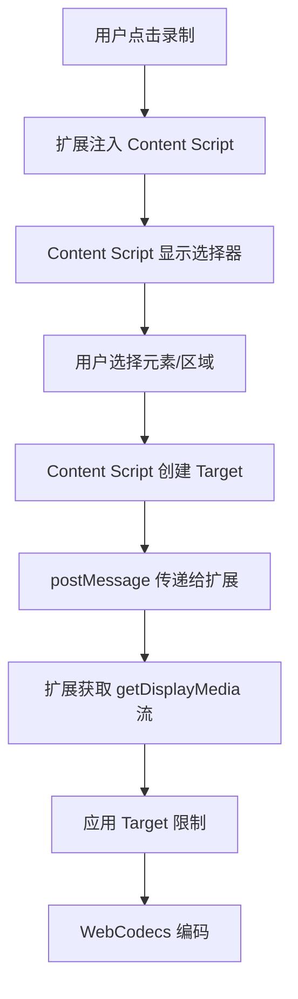

# Chrome 扩展元素和区域录制技术方案修正

## ❗ **重要技术澄清**

### **您的疑问完全正确！**

经过深入分析 Element Capture 和 Region Capture API 的官方文档，我发现了一个关键技术点：

**✅ Element/Region Capture API 本身可以在扩展中调用**
**❌ 但用户选择目标元素必须在目标页面中进行，需要 Content Script**

## 🔍 **技术原理分析**

### **为什么需要 Content Script？**

1. **元素选择交互** - 用户需要在目标页面上点击或框选元素
2. **DOM 访问权限** - 只有 Content Script 能访问页面的 DOM 元素
3. **RestrictionTarget/CropTarget 创建** - 必须在元素所在的文档上下文中创建
4. **跨文档传递** - Target 对象可以通过 postMessage 传递给扩展

### **正确的技术流程**



## 🏗️ **修正后的架构设计**

### **1. Content Script 组件**

```typescript
// content-script.ts
class ElementRegionSelector {
  private overlay: HTMLElement | null = null
  private isSelecting = false
  
  async selectElement(): Promise<RestrictionTarget | null> {
    return new Promise((resolve) => {
      this.startElementSelection(resolve)
    })
  }
  
  async selectRegion(): Promise<CropTarget | null> {
    return new Promise((resolve) => {
      this.startRegionSelection(resolve)
    })
  }
  
  private startElementSelection(callback: (target: RestrictionTarget | null) => void) {
    this.createOverlay('element')
    
    const handleClick = async (event: MouseEvent) => {
      event.preventDefault()
      event.stopPropagation()
      
      const element = event.target as HTMLElement
      
      try {
        // 在目标页面中创建 RestrictionTarget
        const restrictionTarget = await RestrictionTarget.fromElement(element)
        this.cleanup()
        callback(restrictionTarget)
      } catch (error) {
        console.error('Failed to create RestrictionTarget:', error)
        this.cleanup()
        callback(null)
      }
    }
    
    document.addEventListener('click', handleClick, true)
    // ... 其他事件处理
  }
  
  private startRegionSelection(callback: (target: CropTarget | null) => void) {
    this.createOverlay('region')
    
    let startPoint: { x: number, y: number } | null = null
    
    const handleMouseDown = (event: MouseEvent) => {
      startPoint = { x: event.clientX, y: event.clientY }
    }
    
    const handleMouseUp = async (event: MouseEvent) => {
      if (!startPoint) return
      
      const endPoint = { x: event.clientX, y: event.clientY }
      const region = this.calculateRegion(startPoint, endPoint)
      
      try {
        // 创建临时元素来定义区域
        const regionElement = this.createRegionElement(region)
        const cropTarget = await CropTarget.fromElement(regionElement)
        
        this.cleanup()
        callback(cropTarget)
      } catch (error) {
        console.error('Failed to create CropTarget:', error)
        this.cleanup()
        callback(null)
      }
    }
    
    document.addEventListener('mousedown', handleMouseDown)
    document.addEventListener('mouseup', handleMouseUp)
    // ... 其他事件处理
  }
  
  private createOverlay(mode: 'element' | 'region') {
    this.overlay = document.createElement('div')
    this.overlay.style.cssText = `
      position: fixed;
      top: 0;
      left: 0;
      width: 100%;
      height: 100%;
      background: rgba(0, 123, 255, 0.1);
      cursor: ${mode === 'element' ? 'crosshair' : 'crosshair'};
      z-index: 999999;
      pointer-events: all;
    `
    
    // 添加提示文字
    const hint = document.createElement('div')
    hint.textContent = mode === 'element' ? '点击选择要录制的元素' : '拖拽选择要录制的区域'
    hint.style.cssText = `
      position: fixed;
      top: 20px;
      left: 50%;
      transform: translateX(-50%);
      background: rgba(0, 0, 0, 0.8);
      color: white;
      padding: 10px 20px;
      border-radius: 5px;
      font-size: 14px;
      z-index: 1000000;
    `
    
    this.overlay.appendChild(hint)
    document.body.appendChild(this.overlay)
  }
  
  private createRegionElement(region: DOMRect): HTMLElement {
    const element = document.createElement('div')
    element.style.cssText = `
      position: fixed;
      left: ${region.x}px;
      top: ${region.y}px;
      width: ${region.width}px;
      height: ${region.height}px;
      pointer-events: none;
      visibility: hidden;
      z-index: -1;
    `
    document.body.appendChild(element)
    return element
  }
  
  private cleanup() {
    if (this.overlay) {
      document.body.removeChild(this.overlay)
      this.overlay = null
    }
    this.isSelecting = false
    // 移除所有事件监听器
  }
}

// 监听来自扩展的消息
chrome.runtime.onMessage.addListener((message, sender, sendResponse) => {
  const selector = new ElementRegionSelector()
  
  switch (message.action) {
    case 'selectElement':
      selector.selectElement().then(target => {
        sendResponse({ success: true, target })
      }).catch(error => {
        sendResponse({ success: false, error: error.message })
      })
      return true // 保持消息通道开放
      
    case 'selectRegion':
      selector.selectRegion().then(target => {
        sendResponse({ success: true, target })
      }).catch(error => {
        sendResponse({ success: false, error: error.message })
      })
      return true // 保持消息通道开放
  }
})
```

### **2. 扩展端集成**

```typescript
// 在 sidepanel/+page.svelte 中修改
async function selectElement(): Promise<RestrictionTarget | null> {
  try {
    // 获取当前活动标签页
    const [tab] = await chrome.tabs.query({ active: true, currentWindow: true })
    
    if (!tab.id) throw new Error('No active tab found')
    
    // 注入 Content Script（如果尚未注入）
    await ensureContentScriptInjected(tab.id)
    
    // 发送选择元素的消息
    const response = await chrome.tabs.sendMessage(tab.id, { action: 'selectElement' })
    
    if (response.success) {
      return response.target
    } else {
      throw new Error(response.error)
    }
  } catch (error) {
    console.error('Element selection failed:', error)
    return null
  }
}

async function selectRegion(): Promise<CropTarget | null> {
  try {
    const [tab] = await chrome.tabs.query({ active: true, currentWindow: true })
    
    if (!tab.id) throw new Error('No active tab found')
    
    await ensureContentScriptInjected(tab.id)
    
    const response = await chrome.tabs.sendMessage(tab.id, { action: 'selectRegion' })
    
    if (response.success) {
      return response.target
    } else {
      throw new Error(response.error)
    }
  } catch (error) {
    console.error('Region selection failed:', error)
    return null
  }
}

async function ensureContentScriptInjected(tabId: number) {
  try {
    // 检查 Content Script 是否已注入
    await chrome.tabs.sendMessage(tabId, { action: 'ping' })
  } catch (error) {
    // Content Script 未注入，进行注入
    await chrome.scripting.executeScript({
      target: { tabId },
      files: ['content-script.js']
    })
  }
}

// 修改录制流程
async function startWorkerRecording() {
  try {
    let stream: MediaStream
    let restrictionTarget: RestrictionTarget | null = null
    let cropTarget: CropTarget | null = null
    
    // 1. 根据配置获取目标
    if (captureConfig.type === 'element') {
      restrictionTarget = await selectElement()
      if (!restrictionTarget) {
        throw new Error('Element selection cancelled')
      }
    } else if (captureConfig.type === 'region') {
      cropTarget = await selectRegion()
      if (!cropTarget) {
        throw new Error('Region selection cancelled')
      }
    }
    
    // 2. 获取显示媒体流
    if (captureConfig.type === 'element' || captureConfig.type === 'region') {
      stream = await navigator.mediaDevices.getDisplayMedia({
        video: { displaySurface: "browser" },
        audio: false,
        preferCurrentTab: true
      })
    } else {
      // 使用现有的 Chrome Extension API
      const streamId = await requestDesktopCapture()
      stream = await getUserMediaFromStreamId(streamId)
    }
    
    // 3. 应用限制
    if (restrictionTarget) {
      const [track] = stream.getVideoTracks()
      await (track as any).restrictTo(restrictionTarget)
      console.log('✅ Applied Element Capture restriction')
    } else if (cropTarget) {
      const [track] = stream.getVideoTracks()
      await (track as any).cropTo(cropTarget)
      console.log('✅ Applied Region Capture restriction')
    }
    
    // 4. 继续现有的 WebCodecs 处理流程
    // ... 现有代码保持不变
    
  } catch (error) {
    console.error('Enhanced recording failed:', error)
    // 错误处理
  }
}
```

## 📋 **修正后的实施计划**

### **新增文件和权限**
```json
// manifest.json 需要添加
{
  "permissions": [
    "activeTab",
    "scripting",
    "desktopCapture"
  ],
  "content_scripts": [
    {
      "matches": ["<all_urls>"],
      "js": ["content-script.js"],
      "run_at": "document_idle"
    }
  ]
}
```

### **开发阶段调整**
| 阶段 | 内容 | 工期 | 主要工作 |
|------|------|------|----------|
| **Phase 1** | Content Script 开发 | 3天 | 元素/区域选择器 |
| **Phase 2** | 扩展端集成 | 2天 | 消息传递、API 调用 |
| **Phase 3** | UI 优化 | 2天 | 用户体验改进 |
| **Phase 4** | 测试调试 | 2天 | 跨文档通信测试 |

## ✅ **技术方案总结**

### **正确的技术路径**
1. **Content Script 负责** - 用户交互、元素选择、Target 创建
2. **扩展端负责** - 录制控制、流处理、编码导出
3. **消息传递** - 通过 chrome.tabs.sendMessage 进行通信
4. **权限要求** - 需要 `activeTab` 和 `scripting` 权限

### **关键技术点**
- ✅ Element/Region Capture API 可以在扩展中使用
- ✅ 但 Target 对象必须在目标页面中创建
- ✅ 需要 Content Script 进行用户交互
- ✅ Target 对象可以跨文档传递

感谢您的提醒，这个技术细节非常关键！没有 Content Script 确实无法实现用户在目标页面上的元素选择交互。
