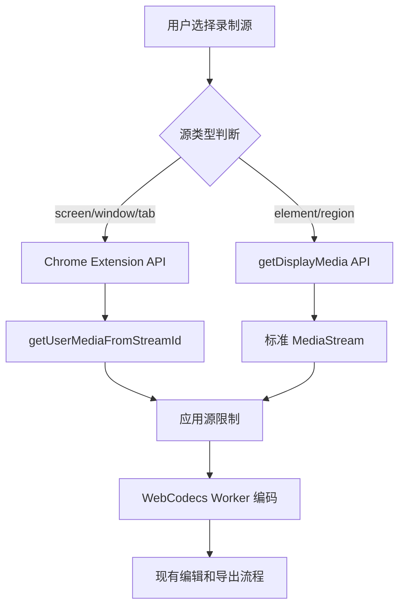

# Chrome 扩展元素和区域录制技术方案设计

## 📋 **需求分析**

### **当前状态**
- ✅ 支持屏幕、窗口、标签页录制（Chrome Extension API）
- ✅ 使用 WebCodecs + Worker 架构进行高性能编码
- ✅ 完整的录制、编辑、导出流程

### **新增需求**
- 🆕 **元素录制** - 录制页面中的特定 DOM 元素
- 🆕 **区域录制** - 录制用户选择的屏幕区域
- 🎯 **保持现有架构** - 不修改编码和编辑流程

## 🔍 **API 技术分析**

### **Element Capture API**
```javascript
// 元素录制核心流程（需要跨文档协作）
// 1. 在目标页面中（Content Script）
const targetElement = document.querySelector('#target')
const restrictionTarget = await RestrictionTarget.fromElement(targetElement)
// 通过 postMessage 发送到扩展

// 2. 在扩展中（Extension Context）
const stream = await navigator.mediaDevices.getDisplayMedia(options)
const [track] = stream.getVideoTracks()
await track.restrictTo(restrictionTarget) // 使用从 Content Script 获得的 target
```

### **Region Capture API**
```javascript
// 区域录制核心流程（需要跨文档协作）
// 1. 在目标页面中（Content Script）
const regionElement = createRegionElement(userSelectedArea)
const cropTarget = await CropTarget.fromElement(regionElement)
// 通过 postMessage 发送到扩展

// 2. 在扩展中（Extension Context）
const stream = await navigator.mediaDevices.getDisplayMedia(options)
const [track] = stream.getVideoTracks()
await track.cropTo(cropTarget) // 使用从 Content Script 获得的 target
```

### **关键发现**

#### **❌ 需要 Content Script 进行元素选择**
- **Element/Region Capture API 本身可以在扩展中使用**
- **但用户选择目标元素需要在目标页面中进行交互**
- **必须使用 Content Script 来实现元素选择器和区域绘制工具**
- 与 Chrome Extension 的 `desktopCapture` API 完全兼容

#### **🔧 API 兼容性和限制**
- **支持版本**: Chrome 121+ (Element Capture), Chrome 104+ (Region Capture)
- **权限要求**: 需要 `display-capture` 权限（已有）+ `activeTab` 权限
- **使用限制**: 只能在 HTTPS 或 localhost 环境使用
- **跨文档要求**: 目标元素必须在被录制的页面中，需要 Content Script 协作

## 🏗️ **架构设计方案**

### **1. 视频源抽象层**

```typescript
// 视频源配置接口
interface VideoSourceConfig {
  type: 'screen' | 'window' | 'tab' | 'element' | 'region'
  element?: HTMLElement        // 元素录制目标
  region?: DOMRect            // 区域录制范围
  selector?: string           // CSS 选择器（备用）
  fallbackToExtension?: boolean // 降级到扩展 API
}

// 视频源管理器
class VideoSourceManager {
  async getMediaStream(config: VideoSourceConfig): Promise<MediaStream>
  async applySourceRestriction(stream: MediaStream, config: VideoSourceConfig): Promise<void>
  checkAPISupport(): CapabilityReport
}
```

### **2. 核心实现流程**



### **3. 集成点设计**

#### **在 sidepanel 中的集成位置**
```typescript
// 在 startWorkerRecording 函数中的插入点
async function startWorkerRecording() {
  try {
    // 1. 根据配置获取流
    let stream: MediaStream
    
    if (captureConfig.type === 'element' || captureConfig.type === 'region') {
      // 使用标准 getDisplayMedia API
      stream = await getDisplayMediaStream(captureConfig)
    } else {
      // 使用现有 Chrome Extension API
      const streamId = await requestDesktopCapture()
      stream = await getUserMediaFromStreamId(streamId)
    }
    
    // 2. 应用源限制（新增）
    if (captureConfig.type !== 'screen') {
      await applyVideoSourceRestriction(stream, captureConfig)
    }
    
    // 3. 继续现有的 WebCodecs 处理流程
    // ... 现有代码保持不变
  } catch (error) {
    // ... 错误处理
  }
}
```

## 🎯 **具体实现方案**

### **Phase 1: 基础架构扩展（2天）**

#### **1.1 类型定义扩展**
```typescript
// src/lib/types/video-source.ts
export interface VideoSourceConfig {
  type: VideoSourceType
  element?: HTMLElement
  region?: DOMRect
  selector?: string
}

export type VideoSourceType = 'screen' | 'window' | 'tab' | 'element' | 'region'

export interface CapabilityReport {
  elementCapture: boolean
  regionCapture: boolean
  getDisplayMedia: boolean
}
```

#### **1.2 能力检测系统**
```typescript
// src/lib/utils/video-source-capabilities.ts
export class VideoSourceCapabilities {
  static checkElementCapture(): boolean {
    return typeof RestrictionTarget !== 'undefined'
  }
  
  static checkRegionCapture(): boolean {
    return typeof CropTarget !== 'undefined'
  }
  
  static checkGetDisplayMedia(): boolean {
    return !!(navigator.mediaDevices?.getDisplayMedia)
  }
  
  static getReport(): CapabilityReport {
    return {
      elementCapture: this.checkElementCapture(),
      regionCapture: this.checkRegionCapture(),
      getDisplayMedia: this.checkGetDisplayMedia()
    }
  }
}
```

### **Phase 2: 核心功能实现（3天）**

#### **2.1 视频源管理器**
```typescript
// src/lib/utils/video-source-manager.ts
export class VideoSourceManager {
  private capabilities: CapabilityReport
  
  constructor() {
    this.capabilities = VideoSourceCapabilities.getReport()
  }
  
  async getMediaStream(config: VideoSourceConfig): Promise<MediaStream> {
    switch (config.type) {
      case 'element':
      case 'region':
        return this.getDisplayMediaStream(config)
      default:
        return this.getExtensionStream(config)
    }
  }
  
  private async getDisplayMediaStream(config: VideoSourceConfig): Promise<MediaStream> {
    const options = {
      video: { displaySurface: "browser" },
      audio: false,
      preferCurrentTab: true
    }
    
    return navigator.mediaDevices.getDisplayMedia(options)
  }
  
  private async getExtensionStream(config: VideoSourceConfig): Promise<MediaStream> {
    // 使用现有的 Chrome Extension API
    const streamId = await ChromeAPIWrapper.requestDesktopCapture(['screen', 'window', 'tab'])
    return ChromeAPIWrapper.getUserMediaFromStreamId(streamId)
  }
  
  async applySourceRestriction(stream: MediaStream, config: VideoSourceConfig): Promise<void> {
    const videoTrack = stream.getVideoTracks()[0]
    if (!videoTrack) throw new Error('No video track found')
    
    switch (config.type) {
      case 'element':
        await this.applyElementRestriction(videoTrack, config.element!)
        break
      case 'region':
        await this.applyRegionRestriction(videoTrack, config.region!)
        break
    }
  }
  
  private async applyElementRestriction(track: MediaStreamTrack, element: HTMLElement): Promise<void> {
    if (!this.capabilities.elementCapture) {
      console.warn('Element Capture API not supported, skipping restriction')
      return
    }
    
    const restrictionTarget = await RestrictionTarget.fromElement(element)
    await (track as any).restrictTo(restrictionTarget)
    console.log('✅ Applied Element Capture restriction')
  }
  
  private async applyRegionRestriction(track: MediaStreamTrack, region: DOMRect): Promise<void> {
    if (!this.capabilities.regionCapture) {
      console.warn('Region Capture API not supported, skipping restriction')
      return
    }
    
    // 创建临时元素来定义区域
    const regionElement = this.createRegionElement(region)
    const cropTarget = await CropTarget.fromElement(regionElement)
    await (track as any).cropTo(cropTarget)
    console.log('✅ Applied Region Capture restriction')
  }
  
  private createRegionElement(region: DOMRect): HTMLElement {
    const element = document.createElement('div')
    element.style.position = 'fixed'
    element.style.left = `${region.x}px`
    element.style.top = `${region.y}px`
    element.style.width = `${region.width}px`
    element.style.height = `${region.height}px`
    element.style.pointerEvents = 'none'
    element.style.visibility = 'hidden'
    document.body.appendChild(element)
    return element
  }
}
```

### **Phase 3: UI 集成（2天）**

#### **3.1 录制源选择器**
```svelte
<!-- src/lib/components/VideoSourceSelector.svelte -->
<script lang="ts">
  import type { VideoSourceConfig, VideoSourceType } from '$lib/types/video-source'
  import { VideoSourceCapabilities } from '$lib/utils/video-source-capabilities'
  
  interface Props {
    config: VideoSourceConfig
    onConfigChange: (config: VideoSourceConfig) => void
  }
  
  let { config, onConfigChange }: Props = $props()
  
  const capabilities = VideoSourceCapabilities.getReport()
  
  function selectSourceType(type: VideoSourceType) {
    onConfigChange({ ...config, type })
  }
  
  async function selectElement() {
    // 触发元素选择器
    const element = await showElementSelector()
    if (element) {
      onConfigChange({ type: 'element', element })
    }
  }
  
  async function selectRegion() {
    // 触发区域选择器
    const region = await showRegionSelector()
    if (region) {
      onConfigChange({ type: 'region', region })
    }
  }
</script>

<div class="video-source-selector">
  <h3>选择录制源</h3>
  
  <div class="source-buttons">
    <button 
      class="source-btn"
      class:active={config.type === 'screen'}
      onclick={() => selectSourceType('screen')}
    >
      🖥️ 屏幕录制
    </button>
    
    <button 
      class="source-btn"
      class:active={config.type === 'element'}
      class:disabled={!capabilities.elementCapture}
      onclick={selectElement}
    >
      🎯 元素录制
    </button>
    
    <button 
      class="source-btn"
      class:active={config.type === 'region'}
      class:disabled={!capabilities.regionCapture}
      onclick={selectRegion}
    >
      📐 区域录制
    </button>
  </div>
  
  {#if config.type === 'element' && config.element}
    <div class="selection-info">
      ✅ 已选择元素: {config.element.tagName}
    </div>
  {/if}
  
  {#if config.type === 'region' && config.region}
    <div class="selection-info">
      ✅ 已选择区域: {config.region.width}×{config.region.height}
    </div>
  {/if}
</div>
```

### **Phase 4: 选择器工具（2天）**

#### **4.1 元素选择器**
```typescript
// src/lib/utils/element-selector.ts
export class ElementSelector {
  private overlay: HTMLElement | null = null
  private isSelecting = false
  
  async selectElement(): Promise<HTMLElement | null> {
    return new Promise((resolve) => {
      this.startSelection(resolve)
    })
  }
  
  private startSelection(callback: (element: HTMLElement | null) => void) {
    this.isSelecting = true
    this.createOverlay()
    
    const handleClick = (event: MouseEvent) => {
      event.preventDefault()
      event.stopPropagation()
      
      const target = event.target as HTMLElement
      this.cleanup()
      callback(target)
    }
    
    const handleEscape = (event: KeyboardEvent) => {
      if (event.key === 'Escape') {
        this.cleanup()
        callback(null)
      }
    }
    
    document.addEventListener('click', handleClick, true)
    document.addEventListener('keydown', handleEscape)
    
    this.cleanup = () => {
      this.isSelecting = false
      this.removeOverlay()
      document.removeEventListener('click', handleClick, true)
      document.removeEventListener('keydown', handleEscape)
    }
  }
  
  private createOverlay() {
    this.overlay = document.createElement('div')
    this.overlay.style.cssText = `
      position: fixed;
      top: 0;
      left: 0;
      width: 100%;
      height: 100%;
      background: rgba(0, 123, 255, 0.1);
      cursor: crosshair;
      z-index: 999999;
      pointer-events: all;
    `
    document.body.appendChild(this.overlay)
  }
  
  private removeOverlay() {
    if (this.overlay) {
      document.body.removeChild(this.overlay)
      this.overlay = null
    }
  }
  
  private cleanup() {
    // 在 startSelection 中定义
  }
}
```

## 📊 **实施计划**

### **时间安排**
| 阶段 | 工作内容 | 工期 | 优先级 |
|------|---------|------|--------|
| Phase 1 | 基础架构和类型定义 | 2天 | 高 |
| Phase 2 | 核心功能实现 | 3天 | 高 |
| Phase 3 | UI 集成 | 2天 | 中 |
| Phase 4 | 选择器工具 | 2天 | 中 |
| **总计** | **完整实现** | **9天** | - |

### **风险评估**
| 风险 | 等级 | 缓解措施 |
|------|------|----------|
| API 兼容性 | 中 | 优雅降级，能力检测 |
| 用户体验 | 低 | 保持默认行为 |
| 现有功能影响 | 极低 | 最小侵入性设计 |

## ✅ **预期效果**

### **功能增强**
- ✅ 支持元素录制（Element Capture API）
- ✅ 支持区域录制（Region Capture API）  
- ✅ 保持现有录制流程完全不变
- ✅ 优雅降级到标准录制

### **技术优势**
- 🚀 **最小侵入** - 仅在视频源获取阶段扩展
- 🚀 **原生性能** - 使用浏览器原生 API
- 🚀 **向后兼容** - 不影响现有功能
- 🚀 **渐进增强** - 可分阶段实施

### **用户体验**
- 🎯 直观的录制源选择界面
- 🎯 可视化的元素/区域选择工具
- 🎯 无缝集成到现有工作流程
- 🎯 保持现有编码和编辑功能

## 🔧 **技术要点总结**

1. **无需 Content Script** - Element/Region Capture API 可直接在扩展中使用
2. **API 兼容性良好** - 与现有 Chrome Extension API 完全兼容
3. **最小架构变更** - 仅在视频源获取阶段插入新逻辑
4. **优雅降级机制** - 不支持新 API 时自动跳过限制
5. **保持现有流程** - 编码、编辑、导出流程完全不变

这个设计方案在保持系统稳定性的同时，以最小的代码变更实现了元素和区域录制功能，是一个平衡了技术先进性和实现复杂度的最优解决方案。

## 📝 **实现细节补充**

### **sidepanel 集成代码示例**

#### **在 +page.svelte 中的具体修改**
```typescript
// 添加视频源配置状态
let captureConfig = $state<VideoSourceConfig>({ type: 'screen' })
let videoSourceManager = new VideoSourceManager()

// 修改 startWorkerRecording 函数
async function startWorkerRecording() {
  try {
    console.log('🎬 [WORKER-MAIN] Starting Worker recording with enhanced video sources...')

    // 1. 根据配置获取媒体流
    let stream: MediaStream

    if (captureConfig.type === 'element' || captureConfig.type === 'region') {
      console.log('📺 [WORKER-MAIN] Using getDisplayMedia for element/region capture...')
      stream = await videoSourceManager.getMediaStream(captureConfig)
    } else {
      console.log('📺 [WORKER-MAIN] Using Chrome Extension API for screen/window/tab capture...')
      const streamId = await requestDesktopCapture()
      if (!streamId) throw new Error('DESKTOP_CAPTURE_CANCELLED')
      stream = await getUserMediaFromStreamId(streamId)
    }

    if (!stream) throw new Error('无法获取媒体流')

    // 2. 应用视频源限制（新增逻辑）
    if (captureConfig.type !== 'screen') {
      console.log('🎯 [WORKER-MAIN] Applying video source restriction...')
      await videoSourceManager.applySourceRestriction(stream, captureConfig)
    }

    // 3. 继续现有的 WebCodecs 处理流程（保持不变）
    console.log('🔧 [WORKER-MAIN] Checking WebCodecs support...')
    if (typeof VideoEncoder === 'undefined') {
      return startSimpleRecording(stream)
    }

    // ... 其余现有代码保持完全不变

  } catch (error) {
    console.error('❌ [WORKER-MAIN] Enhanced recording failed:', error)
    workerEnvironmentIssues = [(error as Error).message || '录制失败']
  }
}
```

### **错误处理和降级策略**

#### **API 支持检测**
```typescript
// src/lib/utils/api-support-detector.ts
export class APISupportDetector {
  static async detectSupport(): Promise<{
    elementCapture: boolean
    regionCapture: boolean
    getDisplayMedia: boolean
    chromeExtension: boolean
  }> {
    return {
      elementCapture: typeof RestrictionTarget !== 'undefined',
      regionCapture: typeof CropTarget !== 'undefined',
      getDisplayMedia: !!(navigator.mediaDevices?.getDisplayMedia),
      chromeExtension: !!(chrome?.desktopCapture)
    }
  }

  static getRecommendedStrategy(support: any): 'hybrid' | 'extension-only' | 'web-only' {
    if (support.chromeExtension && (support.elementCapture || support.regionCapture)) {
      return 'hybrid' // 推荐策略：混合使用
    } else if (support.chromeExtension) {
      return 'extension-only'
    } else {
      return 'web-only'
    }
  }
}
```

#### **优雅降级实现**
```typescript
// 在 VideoSourceManager 中添加降级逻辑
async applySourceRestriction(stream: MediaStream, config: VideoSourceConfig): Promise<void> {
  try {
    const videoTrack = stream.getVideoTracks()[0]
    if (!videoTrack) throw new Error('No video track found')

    switch (config.type) {
      case 'element':
        if (this.capabilities.elementCapture) {
          await this.applyElementRestriction(videoTrack, config.element!)
        } else {
          console.warn('⚠️ Element Capture API not supported, recording full screen')
          this.showUserNotification('元素录制不支持，将录制整个屏幕')
        }
        break

      case 'region':
        if (this.capabilities.regionCapture) {
          await this.applyRegionRestriction(videoTrack, config.region!)
        } else {
          console.warn('⚠️ Region Capture API not supported, recording full screen')
          this.showUserNotification('区域录制不支持，将录制整个屏幕')
        }
        break
    }
  } catch (error) {
    console.error('❌ Failed to apply source restriction:', error)
    // 继续录制，但不应用限制
    this.showUserNotification('视频源限制应用失败，将录制完整内容')
  }
}

private showUserNotification(message: string) {
  // 集成到现有的通知系统
  recordingStore.addNotification({
    type: 'warning',
    message,
    duration: 5000
  })
}
```

### **性能优化考虑**

#### **内存管理**
```typescript
// 清理临时创建的元素
class VideoSourceManager {
  private temporaryElements: HTMLElement[] = []

  private createRegionElement(region: DOMRect): HTMLElement {
    const element = document.createElement('div')
    // ... 设置样式
    document.body.appendChild(element)
    this.temporaryElements.push(element) // 跟踪临时元素
    return element
  }

  cleanup() {
    // 清理所有临时元素
    this.temporaryElements.forEach(element => {
      if (element.parentNode) {
        element.parentNode.removeChild(element)
      }
    })
    this.temporaryElements = []
  }
}
```

#### **性能监控集成**
```typescript
// 在现有的性能监控中添加新指标
class PerformanceMonitor {
  trackVideoSourceRestriction(type: VideoSourceType, duration: number) {
    this.metrics.videoSourceRestriction = {
      type,
      duration,
      timestamp: Date.now()
    }
  }
}
```

### **测试策略**

#### **单元测试**
```typescript
// tests/video-source-manager.test.ts
describe('VideoSourceManager', () => {
  test('should detect API capabilities correctly', () => {
    const capabilities = VideoSourceCapabilities.getReport()
    expect(capabilities).toHaveProperty('elementCapture')
    expect(capabilities).toHaveProperty('regionCapture')
  })

  test('should handle unsupported APIs gracefully', async () => {
    const manager = new VideoSourceManager()
    const mockStream = createMockMediaStream()

    // 模拟 API 不支持的情况
    global.RestrictionTarget = undefined

    await expect(
      manager.applySourceRestriction(mockStream, { type: 'element', element: document.body })
    ).resolves.not.toThrow()
  })
})
```

#### **集成测试**
```typescript
// tests/integration/recording-flow.test.ts
describe('Enhanced Recording Flow', () => {
  test('should maintain backward compatibility', async () => {
    const config = { type: 'screen' as VideoSourceType }
    const result = await startWorkerRecording(config)

    expect(result).toBeDefined()
    expect(workerEncodedChunks.length).toBeGreaterThan(0)
  })

  test('should handle element capture when supported', async () => {
    if (typeof RestrictionTarget !== 'undefined') {
      const element = document.createElement('div')
      const config = { type: 'element' as VideoSourceType, element }

      const result = await startWorkerRecording(config)
      expect(result).toBeDefined()
    }
  })
})
```

## 🚀 **部署和发布策略**

### **分阶段发布**
1. **Alpha 版本** - 基础功能，内部测试
2. **Beta 版本** - 完整功能，用户测试
3. **正式版本** - 稳定发布

### **功能开关**
```typescript
// 使用功能开关控制新功能
const FEATURE_FLAGS = {
  ELEMENT_CAPTURE: true,
  REGION_CAPTURE: true,
  ENHANCED_UI: false
}

// 在代码中使用
if (FEATURE_FLAGS.ELEMENT_CAPTURE && capabilities.elementCapture) {
  // 启用元素录制功能
}
```

### **用户文档**
- 📖 API 兼容性说明
- 🎯 使用指南和最佳实践
- 🔧 故障排除指南
- 📊 性能优化建议

这个完整的技术方案确保了新功能的稳定实现，同时保持了系统的可维护性和扩展性。
