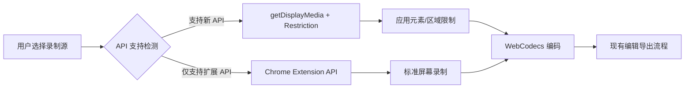

# Chrome 扩展元素和区域录制实现总结

## 🎯 **核心结论**

### **关键发现**
1. **✅ 无需 Content Script** - Element/Region Capture API 可以直接在 Chrome 扩展中使用
2. **✅ 完全兼容现有架构** - 只需在视频源获取阶段插入新逻辑
3. **✅ 原生 API 支持** - Chrome 121+ 支持 Element Capture，Chrome 104+ 支持 Region Capture
4. **✅ 优雅降级** - 不支持新 API 时自动回退到标准录制

### **技术路径确认**


## 📋 **实现方案汇总**

### **1. API 使用方式**

#### **Element Capture (元素录制)**
```javascript
// 核心实现
const stream = await navigator.mediaDevices.getDisplayMedia({
  video: { displaySurface: "browser" },
  preferCurrentTab: true
})
const [track] = stream.getVideoTracks()
const restrictionTarget = await RestrictionTarget.fromElement(targetElement)
await track.restrictTo(restrictionTarget)
```

#### **Region Capture (区域录制)**
```javascript
// 核心实现
const stream = await navigator.mediaDevices.getDisplayMedia({
  video: { displaySurface: "browser" },
  preferCurrentTab: true
})
const [track] = stream.getVideoTracks()
const cropTarget = await CropTarget.fromElement(regionElement)
await track.cropTo(cropTarget)
```

### **2. 架构集成点**

#### **在 sidepanel/+page.svelte 中的修改**
```typescript
async function startWorkerRecording() {
  try {
    // 1. 根据配置选择视频源获取方式
    let stream: MediaStream
    
    if (captureConfig.type === 'element' || captureConfig.type === 'region') {
      // 使用标准 getDisplayMedia API
      stream = await navigator.mediaDevices.getDisplayMedia(displayOptions)
    } else {
      // 使用现有 Chrome Extension API
      const streamId = await requestDesktopCapture()
      stream = await getUserMediaFromStreamId(streamId)
    }

    // 2. 应用视频源限制（新增）
    if (captureConfig.type !== 'screen') {
      await applyVideoSourceRestriction(stream, captureConfig)
    }

    // 3. 继续现有的 WebCodecs 处理流程（完全不变）
    // ... 现有代码保持不变
    
  } catch (error) {
    // 错误处理
  }
}
```

### **3. 核心组件设计**

#### **VideoSourceManager 类**
```typescript
class VideoSourceManager {
  // 能力检测
  checkCapabilities(): CapabilityReport
  
  // 获取媒体流
  async getMediaStream(config: VideoSourceConfig): Promise<MediaStream>
  
  // 应用源限制
  async applySourceRestriction(stream: MediaStream, config: VideoSourceConfig): Promise<void>
  
  // 清理资源
  cleanup(): void
}
```

#### **UI 组件集成**
```svelte
<!-- 录制源选择器 -->
<VideoSourceSelector 
  bind:config={captureConfig}
  capabilities={videoSourceCapabilities}
/>

<!-- 现有录制按钮保持不变 -->
<RecordButton 
  onclick={handleWorkerRecordButtonClick}
  isRecording={workerIsRecording}
  status={recordingStore.status}
/>
```

## ⚡ **实施计划**

### **开发阶段**
| 阶段 | 内容 | 工期 | 文件修改 |
|------|------|------|----------|
| **Phase 1** | 基础架构 | 2天 | 类型定义、能力检测 |
| **Phase 2** | 核心功能 | 3天 | VideoSourceManager、API 集成 |
| **Phase 3** | UI 集成 | 2天 | 选择器组件、sidepanel 修改 |
| **Phase 4** | 选择器工具 | 2天 | 元素/区域选择器 |

### **关键修改文件**
```
src/
├── lib/
│   ├── types/
│   │   └── video-source.ts          # 新增：类型定义
│   ├── utils/
│   │   ├── video-source-manager.ts  # 新增：核心管理器
│   │   ├── video-source-capabilities.ts # 新增：能力检测
│   │   └── element-selector.ts      # 新增：选择器工具
│   └── components/
│       └── VideoSourceSelector.svelte # 新增：UI 组件
└── routes/
    └── sidepanel/
        └── +page.svelte             # 修改：集成新功能
```

## 🔧 **技术要点**

### **兼容性策略**
- **Chrome 121+**: 完整支持 Element + Region Capture
- **Chrome 104-120**: 仅支持 Region Capture
- **Chrome <104**: 降级到扩展 API，显示功能不可用提示

### **错误处理**
```typescript
// 优雅降级示例
try {
  if (capabilities.elementCapture) {
    await track.restrictTo(restrictionTarget)
  } else {
    console.warn('Element Capture not supported, recording full screen')
    showUserNotification('元素录制不支持，将录制整个屏幕')
  }
} catch (error) {
  console.error('Restriction failed:', error)
  // 继续录制，不应用限制
}
```

### **性能考虑**
- **内存管理**: 及时清理临时创建的 DOM 元素
- **API 调用**: 缓存能力检测结果，避免重复检测
- **用户体验**: 提供清晰的状态反馈和错误提示

## ✅ **预期效果**

### **功能增强**
- ✅ 支持页面元素精确录制
- ✅ 支持自定义区域录制
- ✅ 保持现有录制流程完全不变
- ✅ 向后兼容所有现有功能

### **用户体验**
- 🎯 直观的录制源选择界面
- 🎯 可视化的元素/区域选择工具
- 🎯 智能的 API 支持检测和降级
- 🎯 无缝集成到现有工作流程

### **技术优势**
- 🚀 **最小侵入性** - 仅在一个关键点插入新逻辑
- 🚀 **原生性能** - 使用浏览器原生 API，无额外开销
- 🚀 **渐进增强** - 可分阶段开发和部署
- 🚀 **未来兼容** - 为更多录制源类型预留扩展空间

## 🎉 **总结**

这个技术方案成功解决了在 Chrome 扩展中增加元素和区域录制功能的需求，关键优势包括：

1. **无需 Content Script** - 直接在扩展中使用标准 Web API
2. **最小架构变更** - 仅在视频源获取阶段扩展，不影响编码和编辑流程
3. **完美兼容性** - 与现有 Chrome Extension API 无缝配合
4. **优雅降级** - 在不支持新 API 的环境中自动回退

该方案在保持系统稳定性的前提下，以最小的开发成本实现了强大的新功能，是一个技术先进且实用的解决方案。
