# Web Video Editing Engine (2): Frame‑Accurate Seeking with OPFS and GOP Alignment

In [the previous article](./04-editor-memory-sliding-window.en.md), we built a sliding‑window engine that lets the browser handle gigabytes of video as if it were dealing with a few seconds at a time. The “Aw, Snap!” crashes are gone.

Now a new problem appears.

Imagine a user drags the playhead to `05:20`. For a 1GB recording, which byte offset is that?

- The middle?  
- 75% into the file?  
- Somewhere around 500MB?

If you naively guess based on “average bitrate” (say, *10 minutes ≈ 1GB, so 5 minutes ≈ 500MB*), you’ll quickly discover:

> Guesses and compressed video do not mix.  
> At best, you land on the wrong frame. At worst, the decoder shows corrupted garbage.

In this article we’ll look at how Screen Recorder Studio uses `index.jsonl`, GOP structure, and batch reads in `opfs-reader-worker.ts` to achieve **frame‑accurate**, GOP‑safe seeking on top of OPFS.

> 🌟 **About the project**  
> Screen Recorder Studio is an open‑source, browser‑based recording and editing tool. Check out the [GitHub repo](https://github.com/screen-recorder-studio/screen-recorder) or try it from the [Chrome Web Store](https://chromewebstore.google.com/detail/screen-recorder-studio-fo/bondbeldfibfmdjlcnomlaooklacmfpa).

---

## 1. A Physical Law of Video: GOPs and Dependencies

To understand why we can’t “just jump to frame N,” we need to recall a basic fact about modern video codecs:

> **Not every frame is self‑contained.**

Codecs like H.264, VP9 and AV1 organize video into **GOPs – Groups of Pictures**.

```mermaid
graph LR
    I1[I‑Frame #0] --> P1[P‑Frame #1]
    P1 --> P2[P‑Frame #2]
    P2 --> P3[P‑Frame #3]
    P3 --> I2[I‑Frame #4]
    I2 --> P4[P‑Frame #5]
    
    style I1 fill:#f96,stroke:#333,stroke-width:2px
    style I2 fill:#f96,stroke:#333,stroke-width:2px
    style P1 fill:#9cf,stroke:#333
    style P2 fill:#9cf,stroke:#333
    style P3 fill:#9cf,stroke:#333
    style P4 fill:#9cf,stroke:#333
```



- **I‑frames (keyframes)**  
  Full images. They don’t depend on any other frame. Think of them as “save points.”
- **P/B‑frames (delta frames)**  
  They only encode the *difference* from a reference frame. Think of them as “apply these instructions on top of the previous picture.”

This has a crucial implication:

> If you feed the decoder “frame 3” (a delta) without ever giving it the matching I‑frame, it has no idea what to apply the changes to. The result: artifacts, corruption, or outright decode errors.

That leads us to a strict rule in our storage/reader layer:

> **No matter which frame the UI asks for, the reader must start reading at the nearest preceding keyframe for that GOP.**

---

## 2. Drawing the Map: `index.jsonl`

To navigate through a giant OPFS file efficiently, we need a map.

During recording, we write an `index.jsonl` file alongside the raw `data.bin`. Each line describes one encoded chunk:

```json
{"offset":0,"size":4502,"timestamp":0,"type":"key"}
{"offset":4502,"size":120,"timestamp":33333,"type":"delta"}
{"offset":4622,"size":105,"timestamp":66666,"type":"delta"}
...
```

When `opfs-reader-worker.ts` starts up, it reads and parses this file into an in‑memory array:

```ts
interface ChunkIndex {
  offset: number;
  size: number;
  timestamp: number; // microseconds
  type: "key" | "delta";
  isKeyframe?: boolean;
  codedWidth?: number;
  codedHeight?: number;
  codec?: string;
}

let indexEntries: ChunkIndex[] = [];

async function readIndexAll(): Promise<void> {
  const ih = await (recDir as any).getFileHandle("index.jsonl");
  const f = await ih.getFile();
  const text = await f.text();
  const lines = text.split(/\r?\n/).filter(Boolean);
  indexEntries = lines.map((line: string, index: number) => {
    try {
      return JSON.parse(line) as ChunkIndex;
    } catch {
      throw new Error(`INDEX_PARSE_ERROR at line ${index}`);
    }
  });
}
```

This is our **navigation table**: given a time or frame index, we can find the corresponding byte range inside `data.bin`.

---

## 3. Three Steps to Frame‑Accurate Access

When the UI asks for a window around `centerMs: 5000` (5 seconds), the reader performs a three‑step procedure.

### Step 1 – Binary search by (relative) time

Real recordings are almost never perfectly 30fps. Network hiccups and CPU load lead to **variable frame rate (VFR)** behavior. Frame 150 is not guaranteed to be at exactly 5.000 seconds.

So we cannot convert time→frame by a simple multiplication. We **must look it up**.

We first normalize timestamps into a relative timeline (starting from the first chunk), then binary‑search on that:

```ts
function timestampToMs(timestamp: number): number {
  // Timestamps are stored as microseconds by the writer.
  return Math.floor(timestamp / 1000);
}

function idxByRelativeTimeMs(relativeMs: number): number {
  if (indexEntries.length === 0) return 0;

  const firstTimestamp = indexEntries[0]?.timestamp ?? 0;
  const targetAbsoluteMs = relativeMs + firstTimestamp / 1000;

  let lo = 0;
  let hi = indexEntries.length - 1;
  while (lo <= hi) {
    const mid = (lo + hi) >> 1;
    const tMid = timestampToMs(indexEntries[mid]?.timestamp || 0);
    if (tMid <= targetAbsoluteMs) lo = mid + 1;
    else hi = mid - 1;
  }

  return Math.max(0, Math.min(indexEntries.length - 1, hi));
}
```

This gives us the index of the last chunk whose timestamp is **≤** the requested time.

### Step 2 – Backtrack to the keyframe (GOP alignment)

The index we found in step 1 is usually a delta frame. To avoid feeding the decoder partial GOPs, we backtrack to the nearest previous keyframe:

```ts
function keyframeBefore(index: number): number {
  let i = Math.max(0, Math.min(index, indexEntries.length - 1));
  for (; i >= 0; i--) {
    const ent = indexEntries[i];
    if (ent?.isKeyframe === true || ent?.type === "key") {
      return i;
    }
  }
  return 0;
}
```

So even if the UI only cares about “frame 150 at ~5s,” we’ll actually start reading from, say, frame 120 – the last keyframe in that GOP.

### Step 3 – One batch read instead of N small reads

Once we know:

- Start index: `startIdx` (a keyframe).
- End index: `endIdx` (the first frame after the requested time window).

We **do not** call `file.slice()` for each frame. Instead we compute a single byte range:

```ts
const file = await getDataFile();
const chunks: ChunkWire[] = [];
const transfer: ArrayBuffer[] = [];

const startOffset = indexEntries[startIdx].offset;
const endEntry = indexEntries[endIdx - 1];
const endOffset = endEntry.offset + endEntry.size;

const totalSlice = file.slice(startOffset, endOffset);
const totalBuf = await totalSlice.arrayBuffer();

for (let i = startIdx; i < endIdx; i++) {
  const ent = indexEntries[i];
  const relativeOffset = ent.offset - startOffset;
  const buf = totalBuf.slice(relativeOffset, relativeOffset + ent.size);

  const wire: ChunkWire = {
    data: buf,
    timestamp: Number(ent.timestamp) || 0,
    type: ent.type === "key" ? "key" : "delta",
    size: Number(ent.size) || buf.byteLength,
    codedWidth: ent.codedWidth,
    codedHeight: ent.codedHeight,
    codec: ent.codec,
  };

  chunks.push(wire);
  transfer.push(buf);
}
```

The end result: one physical I/O, many logical chunks. This dramatically reduces I/O overhead when scrubbing.

---

## 4. Trade‑offs: Long GOPs and Time Normalization

### 4.1 The cost of long GOPs

GOP alignment keeps the decoder happy, but it isn’t free.

In an extreme case, if a GOP spans 10 seconds of video (for example, during a mostly static screen recording) and the user requests a frame at 9.9 seconds, we still need to:

- Read the entire 10‑second GOP.
- Decode all frames from the keyframe up to the requested frame.

This is why the next part of the system – the **frame buffer** inside the composite worker – is so important. Once a GOP has been decoded, we cache those `VideoFrame`s instead of throwing them away immediately. That’s what enables smooth scrubbing and reuse without re‑decoding everything on every seek.

### 4.2 Microseconds vs milliseconds: building a friendly timeline

- **WebCodecs internals** use **microseconds (μs)** for timestamps.  
  The raw values are usually large monotonic numbers tied to “time since system start,” e.g. `13948200000`.
- **The UI timeline** wants **milliseconds (ms)** starting at `00:00.000`.

In `opfs-reader-worker.ts` we normalize timestamps before sending them back to the UI:

```ts
const firstTimestamp = indexEntries[0]?.timestamp || 0;
const startMs =
  ((indexEntries[startIdx]?.timestamp || 0) - firstTimestamp) / 1000;
const endMs =
  ((indexEntries[Math.max(startIdx, endIdx - 1)]?.timestamp || 0) -
    firstTimestamp) /
  1000;
```

This ensures that, from the editor’s perspective, the very first frame is always at `00:00.000`, regardless of what the underlying system clock was during recording.

In the actual implementation, this “relative time” is not only used in the reader for window boundaries; the Studio layer also combines:

- Relative timestamps from the reader, and
- Global frame count + inferred FPS

to derive a **logical global duration**. That duration powers the timeline scale, scrubbing behavior, and export time calculations. You can think of the reader as exposing “physical time indices,” while the editor layer builds a human‑friendly, frame‑based “logical timeline” on top.

For the 30–60fps screen‑recording scenarios we primarily target, a millisecond‑based timeline is precise enough to be effectively frame‑accurate. If in the future we move into 120fps+ editing, we can tighten this further by:

- Using sub‑millisecond resolution in the UI, or
- Carrying more precise time information alongside our frame indices.

---

## 5. Summary and What’s Next

By combining **`index.jsonl`**, **binary search**, **GOP‑safe keyframe backtracking**, and **batch reading**, Screen Recorder Studio achieves:

1. **Speed** – minimal I/O operations, even when scrubbing aggressively.
2. **Accuracy** – time‑based seeks respect variable frame rate and land on the right frames.
3. **Stability** – decoders never see “half a GOP”; we always start from a valid keyframe, avoiding artifacts.

At this point, the reader hands us a precise stream of `Uint8Array`-backed encoded chunks. That’s good for machines, but useless for humans.

> How do we turn these raw byte ranges into smooth, 60fps video with background blur, rounded corners, shadows, and zoom animations – all without freezing the main thread?

In the next article, we’ll move into the visual core of the system:  
**[Web Video Editing Engine (3): Offscreen Rendering Pipeline and Real‑Time Compositing](./06-editor-rendering-pipeline.en.md)**.

---

> **Previous**: [Web Video Editing Engine (1): Memory Virtualization and the Sliding Window](./04-editor-memory-sliding-window.en.md)  
> **Next**: [Web Video Editing Engine (3): Offscreen Rendering Pipeline and Real‑Time Compositing](./06-editor-rendering-pipeline.en.md)

