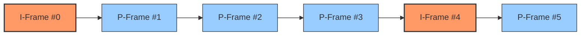

# Web 视频剪辑引擎 (2)：基于 OPFS 与 GOP 的帧级精准定位

> 🌟 开源不易，觉得好用请给个 Star 支持一下：[GitHub](https://github.com/screen-recorder-studio/screen-recorder)
>
> 🚀 立即去 Chrome 商店免费体验：[Chrome Web Store](https://chromewebstore.google.com/detail/screen-recorder-studio-fo/bondbeldfibfmdjlcnomlaooklacmfpa)

---

## 1. 引言：从“虚拟内存”到“精准导航”

在[上一篇文章](./04-editor-memory-sliding-window.md)中，我们成功构建了一套“滑动窗口”机制，像打地道战一样，让浏览器在毫不知情的情况下处理了几个 GB 的视频文件。内存崩溃的危机解除了。

但是，新的挑战随之而来。

试想一下，用户随手将进度条拖到了 `05:20` 的位置。对于一个 1GB 大小的文件，`05:20` 对应的是第几字节？第 100MB？还是第 500MB？

这就像在查一本没有页码的字典。如果我们简单地根据“平均比特率”去估算位置（比如 1GB 视频 10分钟，那中间就是 500MB），结果往往是灾难性的：**用户看到的画面可能会花屏，或者时间错乱。**

今天，我们将深入 Screen Recorder Studio 的存储与读取引擎（`opfs-reader-worker.ts`），揭秘如何实现**帧级精准（Frame-Accurate）**的定位。

## 2. 视频的物理定律：GOP 与依赖链

要理解我们的代码逻辑，首先得理解视频编码的一个物理定律：**不是每一帧都是独立的**。

现代视频编码（H.264, VP9, AV1）为了极致压缩，将视频切分为一个个 **GOP (Group of Pictures)**。



- **I 帧（关键帧 / Keyframe）**：一张完整的图片，不依赖任何人。就像“存档点”。
- **P/B 帧（Delta 帧）**：只记录相对于前一帧的“变化量”。就像“下一页”的指令。

**这意味着：**
如果你直接读取第 3 帧（P 帧）的数据喂给解码器，解码器会一脸茫然：“变化量？基于谁的变化？”结果就是**花屏（Artifacts）**。

**由此引出我们的核心算法铁律：**
> **无论用户请求哪一帧，读取操作都必须“回溯”到该帧所属 GOP 的开头（I 帧）。**

## 3. 绘制地图：`index.jsonl`

为了在茫茫二进制数据中快速导航，我们在录制阶段就绘制了一张“地图”。

打开 OPFS 中的录制目录，你会发现一个 `index.jsonl` 文件。不同于 MP4 复杂的 Atom 树结构，我们采用了一种极简的、流式的索引格式：

```json
{"offset":0,"size":4502,"timestamp":0,"type":"key"}
{"offset":4502,"size":120,"timestamp":33333,"type":"delta"}
{"offset":4622,"size":105,"timestamp":66666,"type":"delta"}
...
```

在 `opfs-reader-worker.ts` 初始化时，我们会将这个轻量级的索引加载进内存。这就是我们的**导航仪**。

## 4. 核心算法：精准定位三步走

当 UI 线程请求 `centerMs: 5000`（5秒处）的数据时，Worker 内部发生了一场精密的手术：

### 第一步：二分查找 (Binary Search)
视频并非总是完美的 30fps。网络波动、CPU 负载都可能导致**可变帧率 (VFR)**。第 150 帧未必在 5.00 秒。

因此，我们不能用简单的数学公式计算位置，必须查表。我们在 `indexEntries` 数组上执行二分查找：

```typescript
// opfs-reader-worker.ts
function idxByRelativeTimeMs(relativeMs: number): number {
  // ...二分查找逻辑...
  // 找到时间戳 <= 目标时间的最后一个索引
  while (lo <= hi) {
    const mid = (lo + hi) >> 1;
    // ...
  }
  return foundIndex;
}
```

### 第二步：GOP 回溯 (Backtracking)
假设二分查找找到了 5秒处对应的索引是 `Frame #150`。但这通常是一个 Delta 帧。
此时，`keyframeBefore` 函数登场。它从 `#150` 开始向前扫描，直到找到最近的一个 `type: 'key'`：

```typescript
// opfs-reader-worker.ts
function keyframeBefore(index: number): number {
  for (let i = index; i >= 0; i--) {
    const ent = indexEntries[i];
    // 优先检查 isKeyframe 标记，兼容性更好
    if (ent.isKeyframe || ent.type === 'key') {
      return i; // 找到了！比如是 Frame #120
    }
  }
  return 0;
}
```

这意味着，虽然用户只要 `#150`，但我们必须从 `#120` 开始读取。

### 第三步：批量读取优化 (Batch Read Optimization)
这是代码中标记为 `🚀 P0 优化` 的关键部分。

如果我们从 `#120` 到 `#150` 循环调用 30 次 `file.slice()`，浏览器的 I/O 开销会极其巨大。
我们的做法是：**计算出的总字节范围，一次性读取**。

```typescript
// opfs-reader-worker.ts
// 1. 计算物理偏移量
const startOffset = indexEntries[startIdx].offset;
const endOffset = indexEntries[endIdx].offset + indexEntries[endIdx].size;

// 2. 一次性 I/O (One Shot)
const totalSlice = file.slice(startOffset, endOffset);
const totalBuf = await totalSlice.arrayBuffer();

// 3. 内存切割
for (let i = startIdx; i < endIdx; i++) {
   // 在内存中 slice，速度极快
   const chunkData = totalBuf.slice(relativeOffset, ...);
   chunks.push(chunkData);
}
```

这种优化将 I/O 次数从 N 次降低到了 1 次，在 HDD 或低速 SSD 上性能提升尤为明显。

## 5. 代价与挑战：解码器的“时间魔法”

### 5.1 精准的代价
GOP 对齐虽然保证了画面不花，但也带来了计算成本。
**极端情况**：如果一个 GOP 长达 10 秒（比如录制静态画面时），用户只是想看第 9.9 秒的一帧，我们依然必须读取并解码前 9.9 秒的所有数据。
这就是为什么我们在下一篇“渲染流水线”中需要引入复杂的**帧缓冲（Frame Buffer）**机制——解码过的帧必须缓存起来，不能用完即弃。

### 5.2 微秒 vs 毫秒的归一化
- **WebCodecs 内核**：严格使用 **微秒 (μs)** (`timestamp`)。录制出的时间戳通常是相对于“系统启动时间”的单调递增值（例如 `13948200000`）。
- **UI 显示**：使用 **毫秒 (ms)**，且必须从 `00:00` 开始。

在 `opfs-reader-worker.ts` 中，我们在返回数据前执行了**时间归一化**：

```typescript
const relativeMs = (chunk.timestamp - firstTimestamp) / 1000;
```

这样做的好处是，无论录制时的系统时间是多少，在编辑器里，第一帧永远是 `00:00.000`，保证了时间轴显示的整洁与一致。

## 6. 总结与悬念

通过 **index.jsonl 索引**、**二分查找**、**关键帧回溯** 和 **批量读取优化**，Screen Recorder Studio 实现了对 OPFS 文件的毫秒级随机访问。

这套机制保证了：
1.  **快**：I/O 操作被合并到最少。
2.  **准**：处理 VFR 视频时不依赖猜测。
3.  **稳**：严格遵循 GOP 规则，绝不给解码器喂“半截”数据。

**但是，别高兴得太早。**

现在我们手里有了一堆精准的 `Uint8Array` 格式的视频数据。但这对用户来说只是一堆乱码。

如何将这些枯燥的二进制流，变成用户眼前流畅的、带有背景模糊、圆角阴影和缩放动效的 60fps 画面？如果每一帧都去操作 DOM，浏览器会卡死吗？

下一篇，我们将进入最终章，解析 **[Web 视频剪辑引擎 (3)：离屏渲染流水线与即时合成技术](./06-editor-rendering-pipeline.md)**。

---

> **上一篇**：[Web 视频剪辑引擎 (1)：内存虚拟化与滑动窗口机制](./04-editor-memory-sliding-window.md)
> **下一篇**：[Web 视频剪辑引擎 (3)：离屏渲染流水线与即时合成技术](./06-editor-rendering-pipeline.md)
